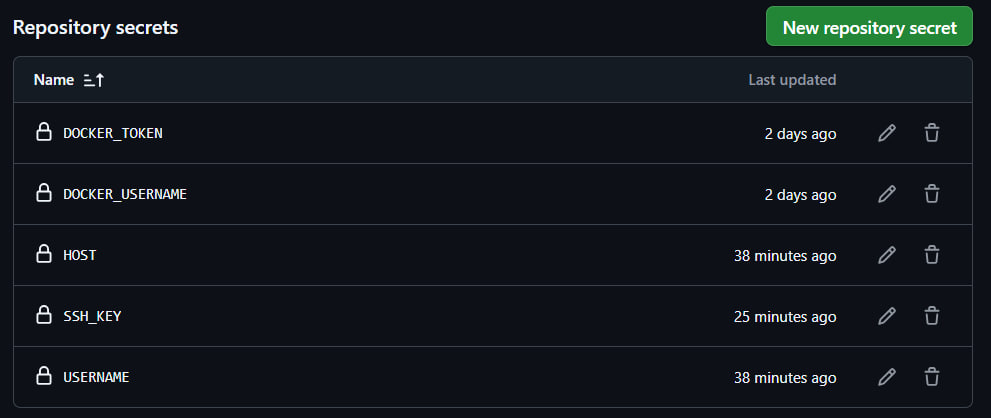
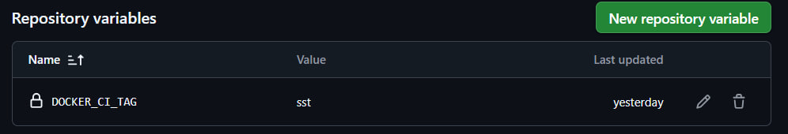

# Базовая структура для сервиса

Шаблон в базовой комплектации с:

- **[Streamlit](streamlit-visualization/README.md)**
- **[Backend](backend/README.md)**
- **[Telegram bot](telegram-bot/README.md)**
- PostgresDB
- **[CI/CD](.github/workflows/ci-cd_master.yml)**

Остальные прибамбасы:

- .env.example (можно переименовать в .env и бэк запустится)

## Фичи шаблона

- Сделано без курсора (no cursor)
- Быстрый деплой

## Деплой

Сервис поддерживает CI/CD со следующим пайплайном:

1. Сборка контейнеров
2. Пуш в Docker.Hub, ветка develop
3. Тестирование контейнеров из develop
4. Если проверки пройдены, пуш контейнеров в latest
5. Деплой на сервер

Постарался сделать все докер компоузы полностью динамическими, чтобы не создавать много разных файлов под сборку

- docker-compose-ci.yaml под автоматическую сборку с помощью CI/CD пайплайна
- docker-compose.yaml под сборку локально, для локальных тестов

## Github Actions

Для работы CI/CD нужно в GitHub Actions создать переменнные

- Добавлена переменная GHP_PAT для приватных репозиториев!

- Переменные секретные (SSH_KEY, DOCKER_USERNAME, PASSWORD, etc.)

- Общие переменные (для репы, например)

### ci-cd lite

Для быстроты деплоя (для всяких тестовых сборок) сделал ci-cd_master-lite.yml, состоящий всего из одного шага - деплоя.

## TODO List

[x] - Сделать рабочий шаблон

[x] - Сделать понятный CI/CD написанный вручную

[ ] - Настроить reverse-proxy (nginx)

[ ] - Сделать CI/CD под другие ветки и другие события (пулл, пуш)

[ ] - Сделать простую интеграцию с redis, qdrant, ollama, etc.

[x] - Сделать простой деплой на сервер

[ ] - Разобраться с CI/CD на gitlab и др. платформах

[ ] - Сделать тесты на производительность с мониторингом

[ ] - Сделать поддержку Docker Registry